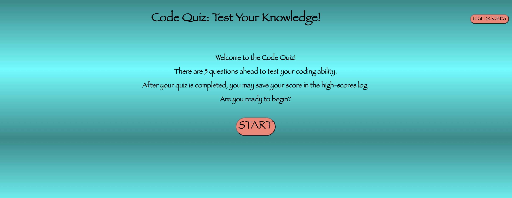

# Challenge #4 - Code Quiz

## Description

    This project was about using dynamically generated elements through javascript and web API's. The application opens and presents the user with an intro screen, allowing them to read what the app does, start the quiz, and check the highscores that are currently saved.
    Once the user clicks the start button, the questions will appear one at a time, until all 5 have been answered. Answering incorrectly penalizes the user's remaining time (and subsequently score) by 15 sec. After reaching the end, the user can provide their initials to store their score alongside previous players.

## Experience Gained

    This challenge should not have been as difficult as I made it. The majority of the bugs were very small errors. For instance, in several places, rather than writing createElement, I had written querySelector. Another mistake that I had made when I first attempted this challenge previously in October/November was introducing a complicated naming convention. I started out this attempt by commenting out my previous code and reorganizing it in a very clear manner with names that clearly describe the use of each function and variable. I definitely gained valuable experience with refactoring code and writing code in general.

## GitHub Links (Deployed Site and Repository)

    The project deployment can be seen at: https://github.com/ekball/C4-Code-Quiz

    The repository link: https://ekball.github.io/C4-Code-Quiz

## Deployed Site Screenshot

